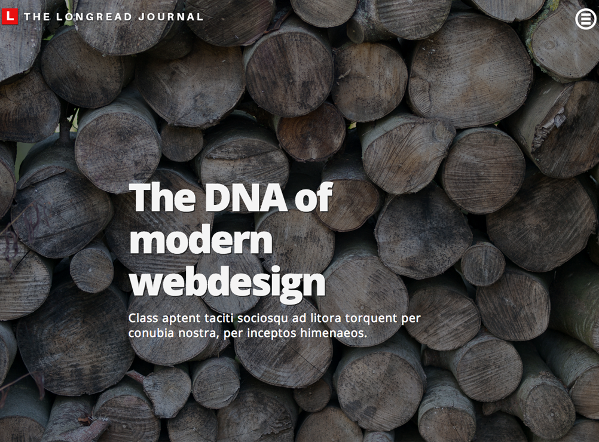

The Longread Journal
===

===

#### Current state: BETA Version 0.96.6
This means there's a lot of messy code and the theme will undergo many internal changes. I will not change the frontend layout.

### Wordpress Install And Use Instructions
- Download the file
- Upload to server and install the theme
- When installed set up the menus
  There are two menu positions in the theme: one in the push/reveal sidebare and one on the frontpage

##### Shortcodes
- [quote] ... [/quote]
- [big-image type="INSERT-TYPE"] IMAGE-URL [/big-image]
  - The type can be either SCROLL or FIXED. Image will break if no type is specified. FIXED reverts to SCROLL on mobile devices   

A lot more Shortcodes in the works..

The theme has no comment template installed and the code comes with DISQUS coded directly into the theme. Go to discus and sign up. Insert your username in the code to make it load. You can also insert facebook comments into the same area, but not through plugins.

Contact me at @jfanc if you have any questions.
